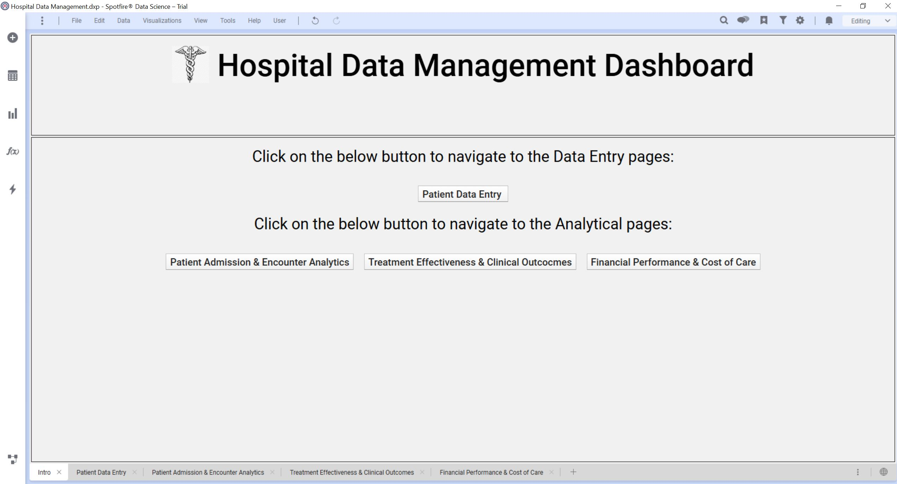

# 🏥 Hospital Data Management Dashboard  
*A TIBCO Spotfire Interactive Analytics & Data-Entry System*

This repository contains a **Spotfire dashboard (.dxp)** designed to streamline hospital data intake and provide deep analytical insights across patient demographics, admissions, Financial performance, treatments, and clinical outcomes.

The dashboard integrates **data entry**, **data quality monitoring**, and **advanced analytics** into a unified interface for healthcare institutions.

---

## 📌 Key Features
- **Patient Data Entry Interface** – Enter and update the source system directly from Spotfire  
- **Admission & Encounter Analytics** – Track patient volume, demographics, stay duration, and disease categories  
- **Clinical Outcomes & Treatment Effectiveness** – Understand how treatments correlate with outcomes  
- **Financial Performance Monitoring** – Analyze cost of care and department-wise performance  
- **Interactive Filtering** – Explore data by doctor, disease type, age group, gender, and more  

---

# 📂 Dashboard Pages

## 1️⃣ Intro Page – Navigation Hub 

The **Intro** page acts as the central navigation hub of the dashboard.  
It provides quick access to both **data-entry** and **analytics** modules.

### **Purpose**
- Guide users to the correct functional area  
- Provide a clean and user-friendly entry point  

### **Components**
- **Data Entry** button:
  - Patient Data Entry 
- **Analytics Navigation** buttons:
  - Patient Admission & Encounter Analytics  
  - Treatment Effectiveness & Clinical Outcomes  
  - Financial Performance & Cost of Care  

---
## 2️⃣ Patient Data Entry Page  

This section provides an intuitive **form-based data entry interface** inside Spotfire.

### **Purpose**
Allows users to manually input or update patient demographic details.

### **Form Fields**
- Patient ID  
- First Name & Last Name  
- Gender  
- Height (cm) & Weight (kg)  
- Marital Status  
- Nationality  
- Blood Type  
- Birth Date  

### **Features**
- Drop-down menus for controlled data entry  
- Submit button for adding new entries  
- Full patient table for real-time verification  

---
##  3️⃣  Patient Admission & Encounter Analytics  

This page provides **descriptive and interactive analytics** focused on hospital admissions, demographics, and disease categories.

### **Purpose**
Helps hospital administrators and clinicians understand:
- Patient inflow  
- Doctor distribution  
- Disease burden trends  
- Gender & age-based distributions  

### **Key Visualizations**
#### 🧮 KPI Summary Tiles
- Total Patient Count  
- Female Patient Count  
- Male Patient Count  
- Doctor Count  

#### 📈 Average Stay Duration vs Age  
A line chart showing:
- Relationship between **age** and **stay duration**  
- Gender-based comparison (Male vs Female)

#### 📊 Disease Type per Age Category  
Bar chart representing:
- Distribution of disease types across age groups  
- Separate bars for gender comparison  

#### 👨‍⚕️ No. of Specialists Treating Each Disease Type  
- Shows which specialties treat the highest volume of cases  
- Useful for workload planning  

#### 🧾 Patient Details Table  
- Displays detailed information for individual patients  
- Includes doctor-based filtering and reset options  

---

This is a great request! Based on the provided snapshots of the Spotfire dashboard, here is a professional and detailed GitHub README structure outlining the purpose and key visualizations of each page.

***

# Spotfire Hospital Data Management Dashboard

This dashboard is designed to provide comprehensive insights into patient clinical outcomes, treatment effectiveness, and financial performance across various encounters. It serves as a centralized tool for healthcare administrators and clinical analysts to monitor key metrics, identify trends, and optimize care delivery and cost management.

## 📊 Dashboard Pages

The dashboard is structured into three main analytical pages, each focusing on a distinct area of hospital operations and patient care.

---

## 1. Patient Admission & Encounter Analytics (Snapshot not provided, but assumed)

* **Purpose:** To provide an overview of patient demographics, admission trends, length of stay, and initial diagnosis patterns. This page typically helps in understanding patient flow and operational efficiency.
* **Key Visualizations (Inferred):**
    * **Time Series Charts:** Admissions/Discharges by month/year.
    * **Bar Charts:** Distribution of patient demographics (Age, Gender, Location).
    * **Tables:** Top 'N' reasons for admission (Primary Diagnosis).

---

## 2. Treatment Effectiveness & Clinical Outcomes

This page focuses on the clinical journey of patients, comparing vital signs, lab results, and treatment details between admission and discharge to assess the effectiveness of care.

| Section | Purpose | Key Visualizations & Metrics |
| :--- | :--- | :--- |
| **Vitals** | Monitor changes in key vital signs from **Admission** (Red line) to **Discharge** (Green line) across selected Encounters. | **Line Charts:** Diastolic BP, Heart Rate, O2 Sat, Resp Rate, Systolic BP, Temperature. **Goal:** Identify improvements or stability in patient condition. |
| **Lab Test** | Track the values of crucial laboratory tests upon admission and discharge. | **Scatter Plot:** CBC, Chem, CRP, Lipids (Y-axis: Value; X-axis: Encounter ID and Status). **Goal:** Assess the impact of treatment on objective physiological markers. |
| **Treatment Details** | A detailed table listing the diagnosis, disease type, and the specific treatments (Drug, Therapy, Surgery) administered to the patient in the selected encounters. | **Table:** Encounter ID, Admission Diagnosis, Disease Type, Treatment Type, Treatment Name (e.g., Aspirin, Statins, Olmesartol). |
| **Special Test** | Visualize the results of specialized diagnostic tests. | **Scatter Plot:** D-Dimer, Erythrocyte Sedimentation Rate (ESR), LDLP Gene Mutation Test, Synovial Fluid Analysis. **Goal:** Monitor markers related to specific conditions (e.g., D-Dimer for thrombosis, ESR for inflammation). |
| **Encounter Selector** | Allows the user to select specific patient encounters (`Encounter ID`) to filter all charts and tables on the page. | **List Box:** Filtering mechanism for granular analysis. |

---

## 3. Financial Performance & Cost of Care

This page provides an in-depth view of the financial aspects of care, focusing on treatment costs, insurance coverage, and resource utilization (room occupancy).

| Section | Purpose | Key Visualizations & Metrics |
| :--- | :--- | :--- |
| **Treatment & Insurance Details** | Correlates administered treatments with the insurance plan type to analyze potential cost differences or coverage gaps. | **Table:** Encounter ID, Treatment Type, Treatment Name, Insurance Plan Name (Basic/Premium). **Key Insight:** Understanding which treatments are used under different insurance tiers. |
| **Room Type vs Occupancy by month** | Analyzes resource utilization by tracking the number of rooms occupied for each room type over the year. | **Heatmap/Treemap:** Y-axis: Occupancy by Month; X-axis: Room Type (Deluxe, Standard, Suite). **Color:** No. of Rooms Occupied in a Month (ranging from Min to Max). **Key Insight:** Hospital capacity planning and demand patterns. |
| **Cost Distribution** | Breaks down the **Total Cost** of care into its major contributing categories. | **Treemap:** Area represents the proportion of cost. Categories include: **SurgeryCost**, **RoomCost**, **DrugCost**, **AdditionalFees**, **RadianceFees**, **Chemo**, **PsychologicalSupport**, and **NutritionCost**. **Key Insight:** Identify the largest cost drivers. |
| **Total Cost Vs Insurance Coverage** | A high-level summary of the total billed amount versus the amount covered by insurance. | **Pie Chart/Donut Chart:** **Total Cost** (e.g., 59.9%) vs. **Insurance Coverage** (e.g., 40.1%). **Key Insight:** Financial viability and out-of-pocket costs for patients. |

***

## 🛠️ Technology Stack

* **Data Visualization Tool:** TIBCO Spotfire
* **Data Source:** Hospital Encounter Data (Likely sourced from an EMR/EHR system and Financial systems)

***

## 💡 How to Use the Dashboard

1.  **Select Encounters:** Start by using the **Encounter ID** filter (in the **Treatment Effectiveness** page) to focus on a specific patient or a group of patients.
2.  **Analyze Clinical Outcomes:** Use the **Vitals** and **Lab Test** charts to quickly determine if the patient's condition improved between admission and discharge.
3.  **Evaluate Cost Drivers:** Switch to the **Financial Performance** page to see how the treatments administered contributed to the overall **Cost Distribution** and the patient's **Insurance Coverage**.
4.  **Operational Review:** Use the **Room Type vs Occupancy** chart to understand how busy the hospital was during a particular period.
